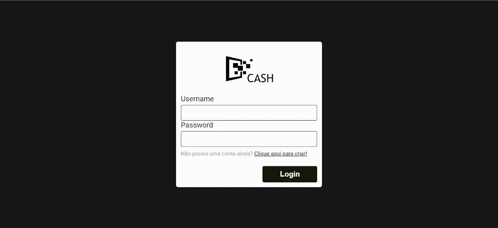
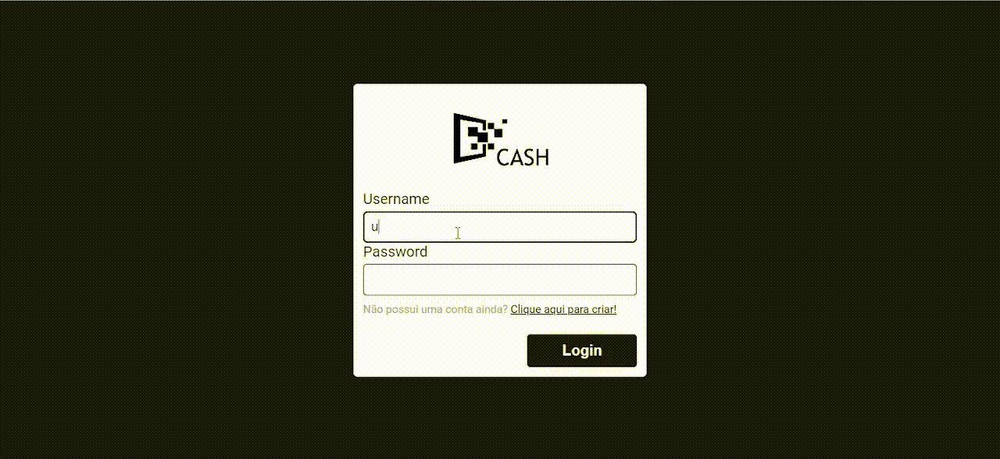
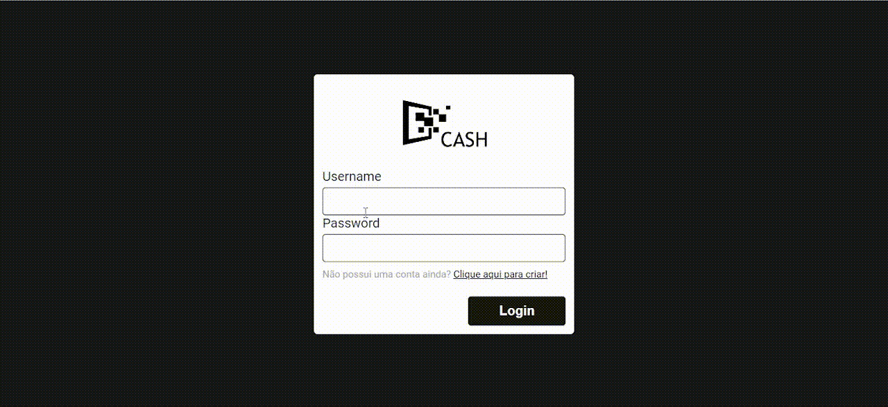
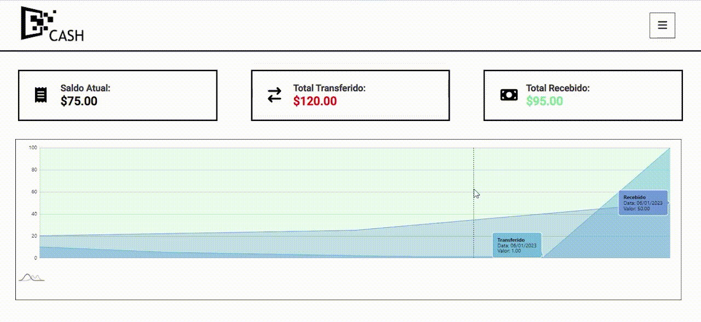

# Cash App

Projeto feito como um desafio de integração back e front, a aplicação deve permitir que um usuário se cadastre apenas com username e password, e efetue transações de valores da sua conta para a de outros usuários e também consulte as transações em que participa.

## Principais tecnologias

Back-End: 

- Node.js utilizando Typescript;
- Prisma como ORM;
- Banco de dados PostgreSQL.

Front-End:

- React.js
- CSS3

## Funcionamento

### Criação de conta

  

### Login e transferêcia

  

### Gráfico

  

### Filtro e logout

  

## Como executar

No Windows PowerShell ou qualquer outro terminal que você utilize, siga esses passos:

1. Acessar a pasta com "cd CAMINHO DA SUA MÁQUINA/ngcash/server";
2. Rodar o comando "docker compose up";
3. Após o container estar criado e ativo no Docker, rodar o comando "npx ts-node ./src/server.ts";
4. No terminar acessar a pasta do client front-end com "cd CAMINHO DA SUA MÁQUINA/ngcash/web";
5. Rodar o comando "npm start";

Se em algum momento o terminal retornar que a porta a ser utilizada, já está em uso, apenas apertar Y/YES para usar a porta sugerida.

###

Todas as validações necessárias no desafio são realizadas tanto no Back-End como no Front-End.
